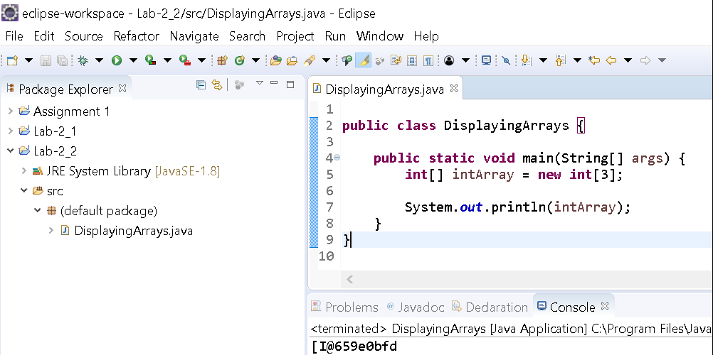
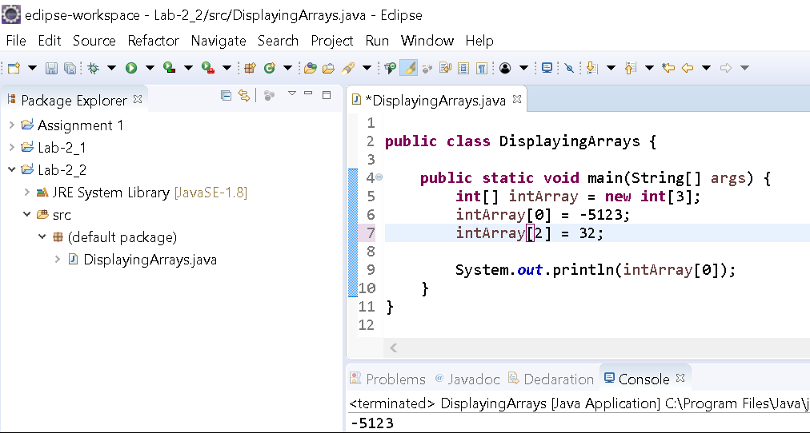
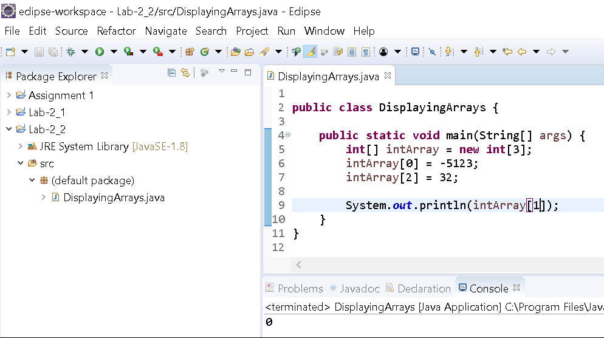
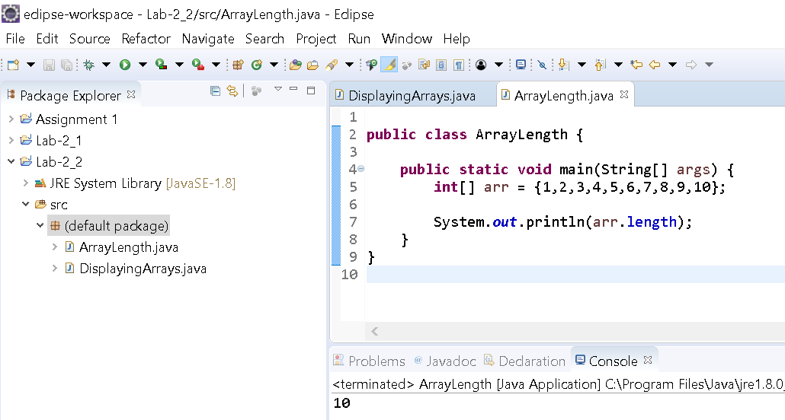

# Arrays

Background
==========

In this exercise, you'll practice creating different arrays and using a few **properties** of arrays.

Arrays are an important construct in many modern languages because they serve as a backbone for higher level data structures. Arrays are also commonly used because they are fast and efficient at obtaining data because of the way the system stores them in memory.

Recall that an array can be thought of as a one-row grid. Each piece of data is referred to as an element and each **element** has a position referred to as an **index**. Array indexes start at 0 (zero).

To create an array you'll specify the datatype followed by brackets (\[\]).

```java
int[] intArray;
```

The above line will create an array of int datatype or an integer array.

To initialize an array you'll need to know its length _beforehand_. For example, to create an array that has 5 elements you would use the following code:

```java
int[] myArray = new int[5];
```

Notice that we've also used the **new** keyword. Anytime you create datatypes other than _primitives_, you'll use the **new** keyword.

Instructions
============

Project Setup
-------------

1.  Open your IDE (Eclipse), and select File > New > Java Project. 
    
2.  Provide the name, **Lab-Arrays** and click OK. 
3.  Right-click on the newly created project and select New > Class.
4.  Provide the class the name, **DisplayingArrays** and click OK.
5.  Now edit the file so that it looks like the following:

```
public class DisplayingArrays {

  public static void main(String[] args) {
    int[] intArray = new int[3];

    System.out.println(intArray);
  }
}
```

Run the program.

You'll notice something peculiar:



The output looks like some mix of characters unrelated to your array. This actually is the default way that a program will print an array. You'll see this often with non-primitive datatypes. The output is actually the address of the memory location of the array. 

To print the _contents_ of the array, we can refer to individual elements.

Edit the class to assign values for two positions in the array and then to print the first value (which is index 0). 

```
public class DisplayingArrays {

  public static void main(String[] args) {
    int[] intArray = new int[3];
    intArray[0] = -5123;
    intArray[2] = 32;

    System.out.println(intArray[0]);
  }
}
```

Run the program.

You should see the following output:



Notice that the _value_ of the first element is printed. Again arrays are zero-based.

Edit the file and to print the second element (the second element will have index 1):

```
public class DisplayingArrays {

  public static void main(String[] args) {
    int[] intArray = new int[3];
    intArray[0] = -5123;
    intArray[2] = 32;

    System.out.println(intArray[1]);
  }
}
```

Run the program.

You should see the following output:



Notice that the program prints the default value of an integer, 0, since we did not specify a value.

Edit the file again to try and print a value outside of the range specified for the array:

```
public class DisplayingArrays {

  public static void main(String[] args) {
    int[] intArray = new int[3];
    intArray[0] = -5123;
    intArray[2] = 32;

    System.out.println(intArray[3]);
  }
}
```

What do you think will happen?

Run the program.

You'll see the following output:


Notice that we didn't get any _compiler errors_. This type of error is referred to as a _Runtime exception_ (because it occurs during the execution or _run_ of the program). Neat, huh?

Reading through the message, you'll see that it is an _ArrayIndexOutOfBoundsException_ and the index that was attempted is 3. This error simply means that you're accessing a position not defined by the array. The index 3 is not part of our array (which has indexes 0, 1, and 2)

As long as you access indexes supported by the array, then you won't get this particular exception…

Array length property
---------------------

What happens if you're writing a bit of code and you were _passed_ or given an array? How would you know what indexes were available?

You can use the **length** property of the array to access its size. This property is automatically populated with the array's size on creation and exists whenever an array is created.

In this part of the exercise we'll create another class in the same project to demonstrate usage of the length property. Yes. You can place multiple classes under one project. Most applications have hundreds of files in one project. :)

1.  Right-click on the newly created project and select New > Class.
2.  Provide the class the name, **ArrayLength** and click OK.
3.  Now edit the file so that it looks like the following:

```
public class ArrayLength {

  public static void main(String[] args) {
    int[] arr = {1,2,3,4,5,6,7,8,9,10};
  }

}
```

Notice that we've used the shortcut way to create an array and initialize it with specific values. Instead of saying **new int\[10\]** we've used curly braces and separated each value with a comma.

This will create an array with 10 elements with the values 1 through 10.

Now print the length of the array to the console:

```
public class ArrayLength {

  public static void main(String[] args) {
    int[] arr = {1,2,3,4,5,6,7,8,9,10};
    System.out.println(arr.length);
  }

}
```

*   Run the program.

You will see the following output:



Congratulations! You're done.
