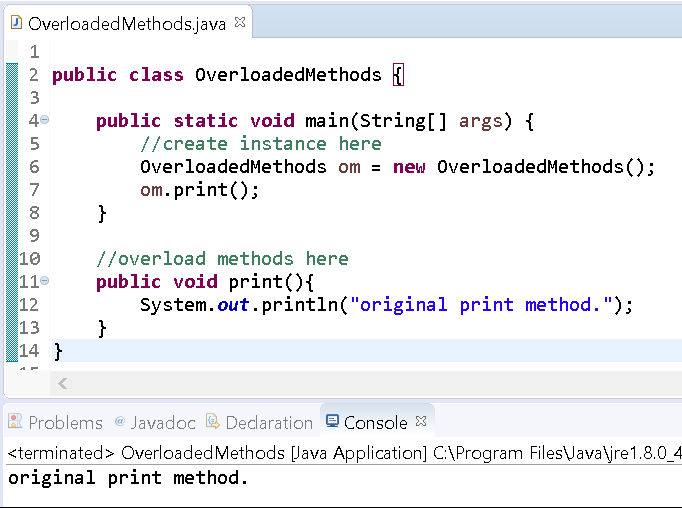
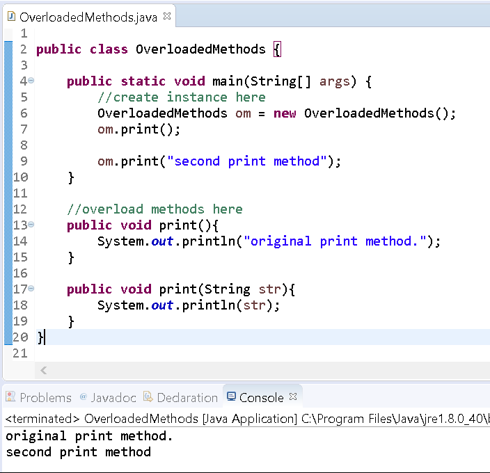
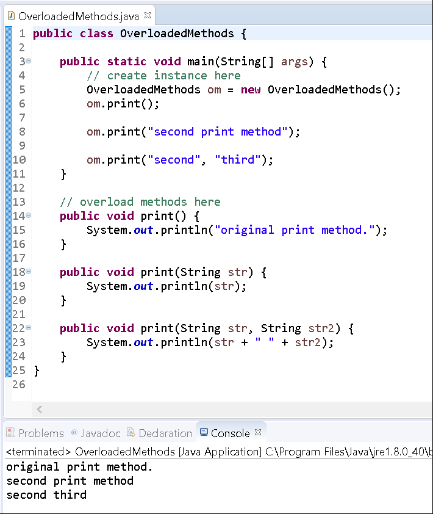
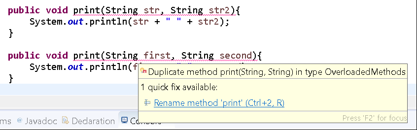

# Method Overloading

## Objectives

* Explain what method overloading is

## Background

A class can define multiple methods.

At times we may want the same type of functionality of one method but use it for different inputs. For example, let's consider an `add()` method that can process either a pair of `int` variables or a pair of `double` variables.

We may write one method as such:

```java
public int add(int a, int b){  
    return a + b;  
}
```

If we want to support the `double` datatype, then we may have something like this:

```java
public double addDouble(double a, double b){  
    return a + b;  
}
```

Based on the above scenario, we have two methods that essentially accomplish the same thing, but operate on different types of parameters. The first method is called `add` and the second is called `addDouble`.

But why make the distinction?

It's not necessary. When writing code, you want to create components that are easy to use and easy to remember. It would be poor design to specify several different names of methods solely on the difference of input types.

To support a better design, Java allows overloading of a method. To **overload** a method you use the same name as another, but specify different parameters.

The following example demonstrates the add method being overloaded:

```java
public int add(int a, int b){  
    return a + b;  
}
```

```java
public double add(double a, double b){  
    return a + b;  
}
```

The following are rules related to overloading:

* overloaded method must have a different number and/or types of parameters (the order can be different as long as the types are different)  
* overloaded methods can throw Exceptions
* overloaded methods can return a different datatype
    

## Guided Practice

Now that we have some background on overloading we'll walk through creating a class with overloaded methods.

Follow the instructions below to create a new project that we will use to practice overloading a method. 

### Project Setup

Open your IDE (Eclipse), and select File > New > Java Project. Provide the name, Lab-Overloading and click OK. Right-click on the newly created project and select New > Class. Provide the class the name, OverloadedMethods and click OK. Now edit the file so that it looks like the following:

```java
public class OverloadedMethods {  
  
    public static void main(String\[\] args) {  
        //create instance here  
    }  
  
    //overload methods here  
}
```

Let's create a `print` method. It'll specify no parameters and just print a `String` and call that method from the main method.

```java
public class OverloadedMethods {  

    public static void main(String\[\] args) {  
        //create instance here  
        OverloadedMethods om = new OverloadedMethods();  
        om.print();  
    }  

    //overload methods here  
    public void print(){  
        System.out.println("original print method.");  
    }  
}  
```

Run the program.

You'll see output like the following:



Now edit the file to overload the print method to declare a String parameter and print the value of the String to the console. Invoke the overloaded method from `main()`.

```java
public class OverloadedMethods {  
  
    public static void main(String\[\] args) {  
        //create instance here  
        OverloadedMethods om = new OverloadedMethods();  
        om.print();  
  
        om.print("second print method");  
    }  
  
    //overload methods here  
    public void print(){  
        System.out.println("original print method.");  
    }  
  
    public void print(String str){  
        System.out.println(str);  
    }  
}
```

Save the file and you'll see that everything compiles fine.

Run the program.

The console will generate output like the following:



Edit the file to overload the method again. This time add another String parameter. Concatenate the two and print them to the console. Invoke this method from `main()` as well. 

```java
public class OverloadedMethods {  
  
    public static void main(String\[\] args) {  
        //create instance here  
        OverloadedMethods om = new OverloadedMethods();  
        om.print();  
        om.print("second print method");  
        om.print("second", "third");  
    }  
  
    //overload methods here  
    public void print(){  
        System.out.println("original print method.");  
    }  
  
    public void print(String str){  
        System.out.println(str);  
    }  
  
    public void print(String str, String str2){  
        System.out.println(str + " " + str2);  
    }  
}
```

Run the program.

You'll see that the compiler correctly chooses the method by matching the parameters to the method's definition.



Lastly, let's try to overload the method again by specifying two `String` parameters with different names.

Edit the file to resemble the following:

```java
public class OverloadedMethods {  
  
    public static void main(String\[\] args) {  
        //create instance here  
        OverloadedMethods om = new OverloadedMethods();  
        om.print();  
        om.print("second print method");  
        om.print("second", "third");  
    }  
  
    //overload methods here  
    public void print(){  
        System.out.println("original print method.");  
    }  
  
    public void print(String str){  
        System.out.println(str);  
    }  
  
    public void print(String str, String str2){  
        System.out.println(str + " " + str2);  
    }  
  
    public void print(String first, String second){  
        System.out.println(first + " " + second);  
    }  
}
```

As you save the file, you'll see that Eclipse displays a compiler error:



Notice that both methods are underlined as the compiler cannot differentiate between either.

Delete the new method that causes the error and save the file.

You're now done with this lab. Mark this activity complete.