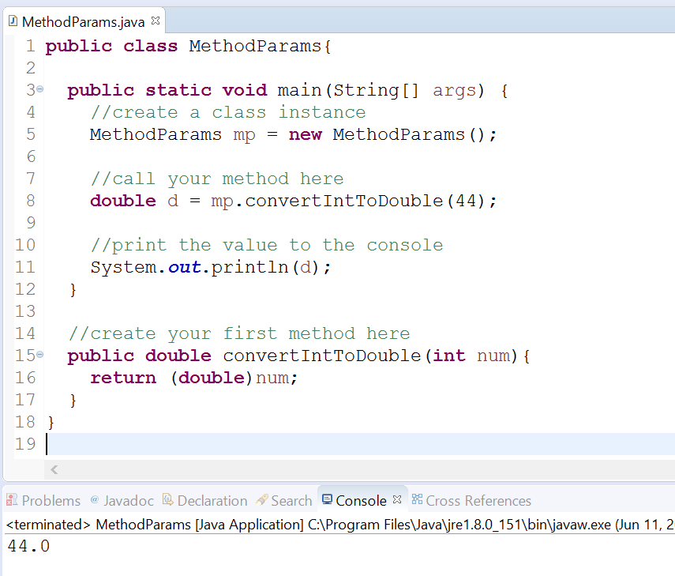
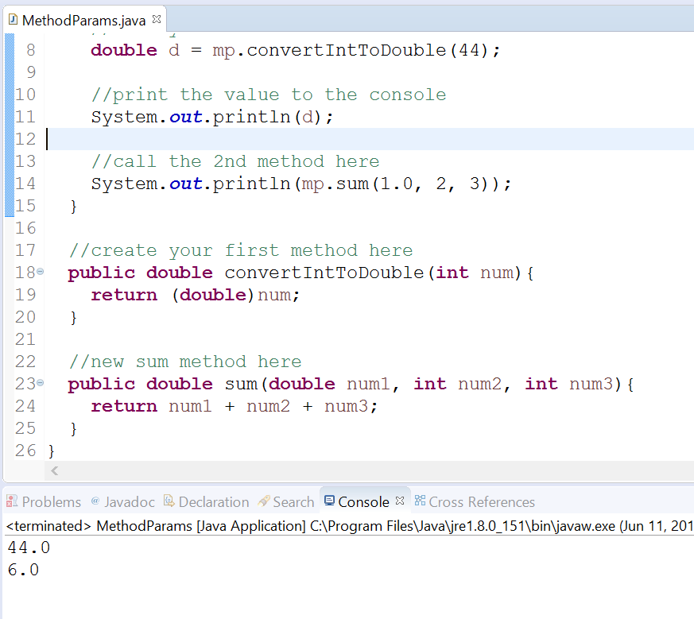

# Methods and Parameters

## Objectives

* Explore how write simple methods with parameters
    
## Background

In this exercise, you'll practice writing a simple method that can accept input.

Recall that a method has several parts:

* modifier
* return\_type   
* methodName
* parameters  
* exceptions   
* method body

Methods resemble the following format:

```java
modifier return_type methodName(parameters) exceptions {
    //method body
}
```

### Parameters

Parameters are input values that your method can accept. You can have any number of parameters that you like. A good rule of thumb is if your parameter list is long (above 6 items), then there is probably an easier way to write your method or structure your class.

To declare a parameter you'll specify the datatype and a name for your parameter. The same rules that apply to variable names apply to parameter names.

### Guided Practice

Now that you have some background on the basics of methods, let's write a few together. 

#### Project Setup

Open your IDE (Eclipse), and select File > New > Java Project.

Provide the name, Lab-MethodParameters and click OK.

Right-click on the newly created project and select New > Class.

Provide the class the name, MethodParams and click OK.

Now edit the file so that it looks like the following:

```java
public class MethodParams{

    public static void main(String[] args) {
        //create a class instance
        MethodParams mp = new MethodParams();

        //call your method here
    }

    //create your first method here 
}
```

### Method with a Parameter

You can create methods that accept **arguments** (values). All you need to do is specify a **parameter** (a variable) for each input that you need.

Let's create a method that will accept one **int** type and return it as a **double** to the user.

```java
public class MethodParams{

    public static void main(String[] args) {
        //create a class instance 
        MethodParams mp = new MethodParams();

        //call your method here
    }

    //create your first method here
    public double convertIntToDouble(int num){
        return (double)num;
    } 
}
```

In the above code, we specified an **int** parameter named num. We could’ve named it anything that we wanted, as long as it followed the same rules for variables. We also declared the method public, declared no exceptions, and specified the return type as `double` because we want to return a double value. 

You can only call methods by using the **dot-operator** on a variable that refers to the class type.

In this case, our variable `mp` needs to call `convertIntToDouble(..)`.

Edit the file so that it calls our method from an instance of MethodParams and prints the value to the console:

```java
public class MethodParams{

    public static void main(String[] args) {
        //create a class instance
        MethodParams mp = new MethodParams();

        //call your method here
        double d = mp.convertIntToDouble(44);

        //print the value to the console
        System.out.println(d);
    }

    //create your first method here
    public double convertIntToDouble(int num){
        return (double)num;
    } 
}
```

Run the program.

You'll see output on the console reflecting the value you passed to your method.



### Using Multiple Parameters

We'll now create a method that accepts multiple parameters. All we need to do is separate each with a comma.

Edit the file to create a new method `sum()` that takes in three parameters. One should be a double and two can be an int:

```java
public class MethodParams{

    public static void main(String[] args) {
        //create a class instance
        MethodParams mp = new MethodParams();

        //call your method here
        double d = mp.convertIntToDouble(44);

        //print the value to the console
        System.out.println(d);
    }

    //create your first method here
    public double convertIntToDouble(int num){
        return (double)num;
    }

    //new sum method here
    public double sum(double num1, int num2, int num3){
        return num1 + num2 + num3;  
    } 
}
```

Now call this method from `main()` method and print the result to the console.

```java
public class MethodParams{

    public static void main(String[] args) {
        //create a class instance
        MethodParams mp = new MethodParams();

        //call your method here
        double d = mp.convertIntToDouble(44);

        //print the value to the console
        System.out.println(d);

        //call the 2nd method here
        System.out.println(mp.sum(1.0, 2, 3));
    }

    //create your first method here
    public double convertIntToDouble(int num){
        return (double)num;
    }

    //new sum method here
    public double sum(double num1, int num2, int num3){
        return num1 + num2 + num3;  
    } 
}
```

In the above code, notice that we didn’t store the returned value from our sum method into a variable. We simply called the method as an argument to the `println()` method. This is valid because the return type of the method is a valid argument to the `println()` method. If the method specified a non-valid type, say void, for example, then the compiler would display an error.

Run the program.

You'll see the value of the result on the console.



Congratulations. You can create methods with parameters now.

This concludes the lab. 