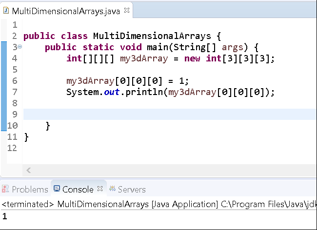
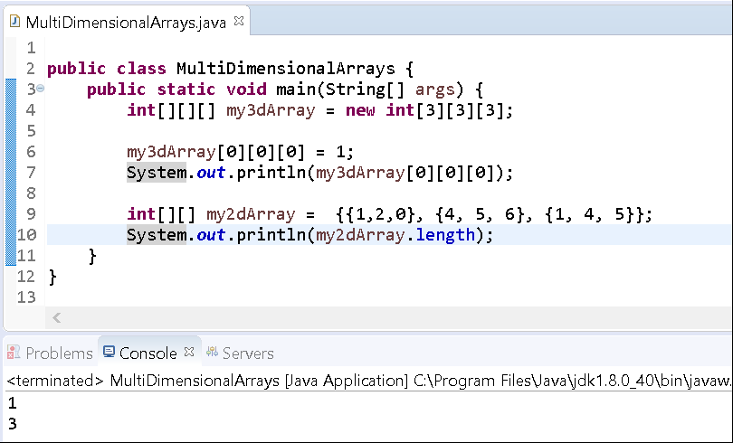
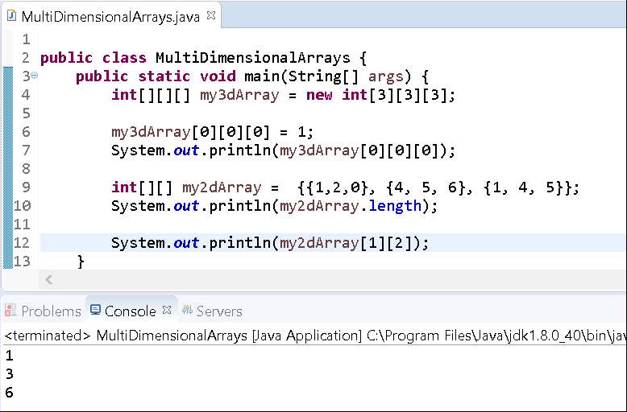

Background
==========

In this exercise, you'll practice creating different multi-dimensional arrays and understand how they are organized.

A multi-dimensional array is an array that has an array as one or more of its elements.

To create a multi-dimensional array you'll specify the datatype followed by the number of brackets (\[\]) according to the number of dimensions that you need.

For example, the following will create a 2-dimensional array that holds integer values. 

int\[\]\[\] array2d;


Note that a 2-dimensional array is one in which the first element is another int array. Instead of thinking of it as a one-row grid, you now have multiple rows. each row is indicated by the first index and the value in that row is indicated by a second index. Essentially multi-dimensional arrays are "arrays of arrays".

Initializing Multi-dimensional Arrays
-------------------------------------

To initialize a multi-dimensional array, you'll need to review the same rules as a single dimension array as they are the same. Most importantly, you should know its length beforehand.

For example, to create a 2D array that is a 5x4 grid, then you would use the following code:

int\[\]\[\] my2dArray = new int\[5\]\[4\];

Notice that we've used the **new** keyword to actually create a new instance of the 2D array. Anytime you create datatypes other than primitives, you'll use the new keyword.

Guided Practice
===============

The following section will walk you through creating a small project to define multi-dimensional arrays. 

Project Setup
-------------

1.  Open your IDE (Eclipse), and select File > New > Java Project.
    
2.  Provide the name, Lab-MultiArrays and click OK.
    
3.  Right-click on the newly created project and select New > Class.
    
4.  Provide the class the name, MultiDimensionalArrays and click OK.
    
5.  Now edit the file so that it looks like the following:
    
```
public class MultiDimensionalArrays{  
  
 public static void main(String\[\] args) {  
   int\[\]\[\]\[\] my3dArray = new int\[3\]\[3\]\[3\];  
 }  
}
```


Now edit your code to assign a value to the first position in your array.
```
public class MultiDimensionalArrays{  
  
 public static void main(String[] args) {  
   int[][][] my3dArray = new int[3][3][3];  
  
   my3dArray[0][0][0] = 1;  
   System.out.println(my3dArray[0][0][0]);  
 }  
}
```


The newly added code will place the value '1' in the zero index of the array which points to the zero index of another array which points to the zero index of yet another array.

If you were to think of each position as a plot in a 3D graph, then the position (0,0,0) is at the origin.

Just like 1-dimensional arrays, multi-dimensional arrays only support positive index values. For example, the following is erroneous: `my3darray[-1][0][-2];`

Run the program.

You'll see output like the following:



This confirms that we've successfully assigned the value of 1 to the first position in our 3D array.

Let's take another approach to creating a multidimensional array. We'll use the shortcut syntax in which we declare the array and initialize it all in one step.

Edit your code to resemble the following:
```
public class MultiDimensionalArrays{  
  
 public static void main(String\[\] args) {  
   int[][][] my3dArray = new int[3][3][3];  
  
   my3dArray[0][0][0] = 1;  
   System.out.println(my3dArray[0][0][0]);  
  
   int[][] my2dArray =  {{1,2,0}, {4, 5, 6}, {1, 4, 5}};  
 }  
}
```

The new line of code uses curly braces to declare the values and groupings of values. In this case, we're creating a 2D array that has the size of 3x3. 

Let's see what happens when we call the **length** property on the array.

Edit your code to resemble the following:
```
public class MultiDimensionalArrays{  
  
 public static void main(String[] args) {  
   int[][][] my3dArray = new int[3][3][3];  
  
   my3dArray\[0\]\[0\]\[0\] = 1;  
   System.out.println(my3dArray\[0\]\[0\]\[0\]);  
  
   int[][] my2dArray =  {{1,2,0}, {4, 5, 6}, {1, 4, 5}};  
   System.out.println(my2dArray.length);  
 }  
}
```

Run the program.

You'll see output like the following:



Notice that the value of 3 is printed. This confirms that our first value of our array is an array with 3 elements (each element being an array of length 3).

Say that we wanted to print the value 6 that is stored in our current array.

At what index does our 2D array contain this value?

Looking at the code, you can verify that the value 6 is in the second array located at the third index of that array. Collectively, the index should be (1,2).

Edit your code to resemble the following:
```
public class MultiDimensionalArrays{  
  
 public static void main(String[] args) {  
   int[][][] my3dArray = new int[3][3][3];  
  
   my3dArray[0][0][0] = 1;  
   System.out.println(my3dArray[0][0][0]);  
  
   int[][] my2dArray =  {{1,2,0}, {4, 5, 6}, {1, 4, 5}};  
   System.out.println(my2dArray.length);  
  
   System.out.println(my2dArray[1][2]);  
 }  
}
```

Run the program.

You'll see output like the following:



We've correctly retrieved the value of 6!

In summary, multi-dimensional arrays behave just like 1-dimensional arrays. The main difference is that you'll specify an additional index for each added dimension. For example, to specify a value in a 4D array you'll need 4 indexes (eg. \[1\]\[2\]\[2\]\[3\])

This concludes the lab.
