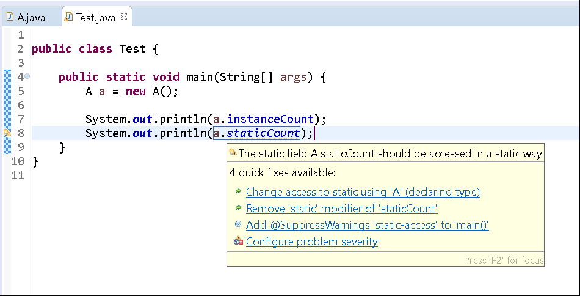
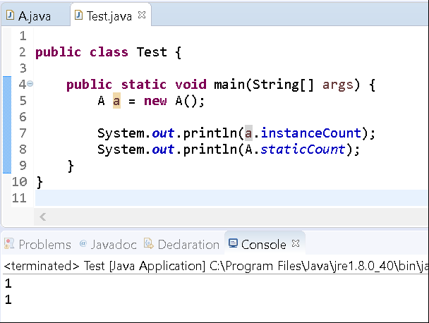
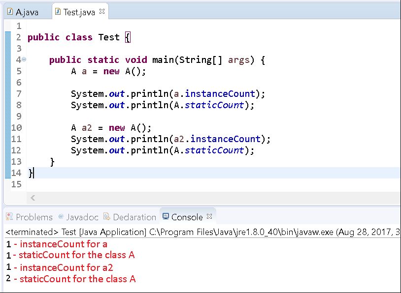
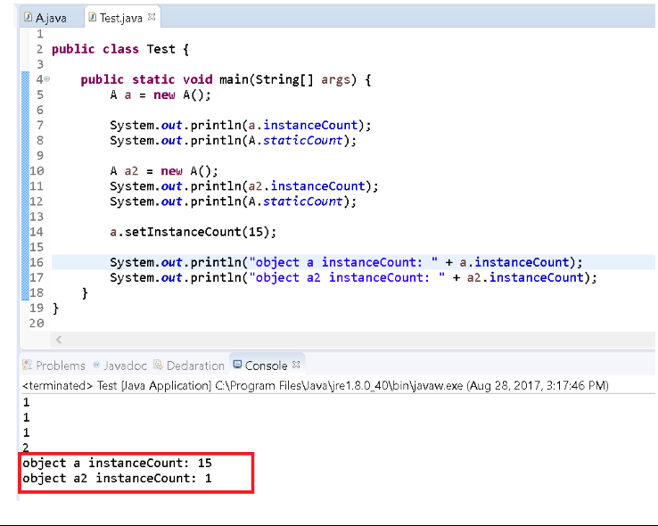
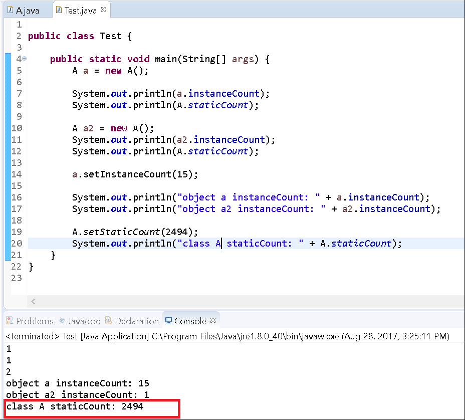

# Static vs Instance

## Objectives

* To understand the difference between static and instance members of a class. 

## Background

A class can declare both static and instance members (variables and methods).

Recall that a static member is shared class-wide while an instance member is associated with a single instance.

In this exercise we'll explore how the two behave differently when referring to properties and methods.

## Guided Practice

Now that you have some understanding of classes in general, we'll explore creating static and instance members.

Follow the instructions below to create a new project. 

### Project Setup

Open your IDE (Eclipse), and select File > New > Java Project. Provide the name, Lab-StaticInstance and click OK. Right-click on the newly created project and select New > Class. Provide the class the name, A and click OK.

Now edit the file so that it looks like the following:

```java
public class A {

    //static member
    public static int staticCount = 0;

    //instance member
    public int instanceCount = 0;
}
```

> **NOTE**: The easiest way to tell if a member is static or not is by the keyword **static** being applied to it. It is static if that keyword appears next to it.

Now, let's add a no-arg constructor to update both values by one and generate some getters and setters for both variables.

```java
public class A {

    //static member
    public static int staticCount = 0;

    //instance member
    public int instanceCount = 0;

    public A() {
        staticCount++;
        this.instanceCount++;
    }

    public static int getStaticCount() {
        return A.staticCount;
    }

    public static void setStaticCount(int staticCount) {
        A.staticCount = staticCount;
    }

    public int getInstanceCount() {
        return this.instanceCount;
    }

    public void setInstanceCount(int instanceCount) {
        this.instanceCount = instanceCount;
    }
}
```

Again, notice that the methods that manipulate staticCount, have the keyword static applied to them. Furthermore, take note that when setting the staticCount variable, we don't use the keyword this, we use the class name to refer to it.

Now that our class is setup, create another class Test in which we'll create instances of A and see how the different members operate.

Edit your newly create Test class to resemble the following:

```java
public class Test {

    public static void main(String[] args) {
        A a = new A();

        System.out.println(a.instanceCount);
        System.out.println(a.staticCount);
    }
}
```
Notice how Eclipse underlines a.staticCount with a yellow line. When you hover your mouse over the line, you'll see the Eclipse suggestion of "The static field A.staticCount should be accessed in a static way."



Currently, we're trying to access the member from an _instance_ of `A`. Instead, we should specify the class name.

Edit the file to access the field from the class as opposed to the instance:

```java
public class Test {

    public static void main(String[] args) {
        A a = new A();

        System.out.println(a.instanceCount);
        System.out.println(A.staticCount);
    }
}
```

Save the file and run the program.

You'll observe output like the following:



In our observance here, we've created an instance of `A` and printed that instance's value for `instanceCount` and we've also accessed the entire class of `A`'s static member of staticCount and printed its value.

Both are one, because when we create an instance, we increment the default value of 0 by 1.

Now let's create another instance of `A` and perform the same operations. Copy/paste the code you have currently and change the variable name from `a` to `a2` for the new instance.

```java
public class Test {

    public static void main(String[] args) {
        A a = new A();

        System.out.println(a.instanceCount);
        System.out.println(A.staticCount);

        A a2 = new A();

        System.out.println(a2.instanceCount);
        System.out.println(A.staticCount);
    }
}
```

Save the file and run the program.

You'll observe that the _static_ count for the entire class is now 2.



So this is what separates a static member from an instance one.

Instance members are associated to an _object_ that is saved in memory (basically, whenever we call the **new** keyword we create an object in memory). We can manipulate data for an instance and it won't affect another instance. This is why the variable `a` has an instance count of 1 and the variable `a2` has an instance count of 1. Both, however, share a static count of 2. 

For example, change the value of the `instanceCount` of reference variable `a` to 15 and print both instance variables (for `a` and `a2`).

```java
public class Test {

    public static void main(String[] args) {
        A a = new A();

        System.out.println(a.instanceCount);
        System.out.println(A.staticCount);

        A a2 = new A();

        System.out.println(a2.instanceCount);
        System.out.println(A.staticCount);

        a.setInstanceCount(15);
   
        System.out.println("object a instanceCount: " + a.instanceCount);
        System.out.println("object a2 instanceCount: " + a2.instanceCount);
    }
}
```

Run the program.

You'll see the following output.



Now let's do the same thing for the static instance variable.

```java
public class Test {

    public static void main(String[] args) {
        A a = new A();

        System.out.println(a.instanceCount);
        System.out.println(A.staticCount);

        A a2 = new A();
        System.out.println(a2.instanceCount);
        System.out.println(A.staticCount);

        a.setInstanceCount(15);

        System.out.println("object a instanceCount: " + a.instanceCount);
        System.out.println("object a2 instanceCount: " + a2.instanceCount);

        A.setStaticCount(2494);

        System.out.println("class A staticCount: " + A.staticCount);
    }
}
```

Run the program.



Here we've demonstrated how to update and access the static variable.

> **NOTE**: If we were to print out the instance variables instanceCount for each object, they would still retain their respective values. The static variable does not affect the instance ones.

You've now completed this exercise. Please mark this activity complete.